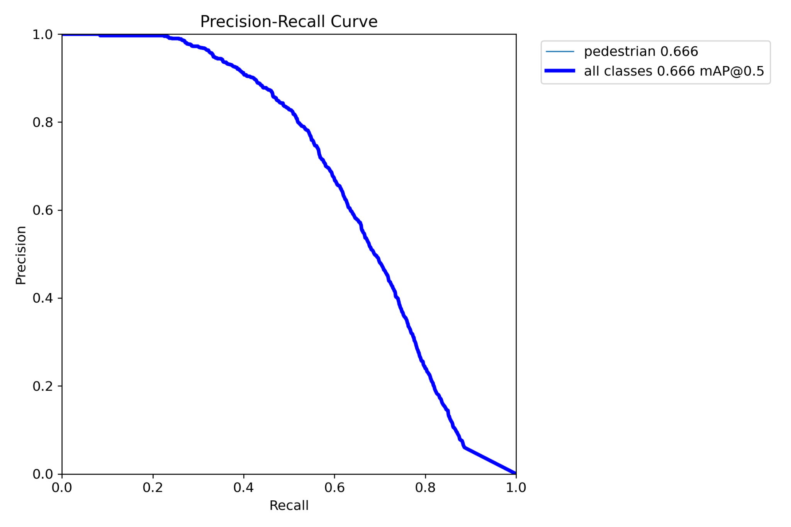

# Synthetic-to-Real Pedestrian Detection with YOLOv8n

A final-year engineering research project evaluating whether synthetic pedestrian imagery can improve **real-world pedestrian detection** performance when training an anchor-free YOLOv8n model.

This repository is structured as a research and reproducibility repository rather than a production deployment. It documents the experimental design, metrics, training commands, dataset setup, and limitations behind the project.

## Project summary

**Research question**

> How effective is synthetic pedestrian data for improving the real-world performance of deep learning pedestrian detection models compared with real-world data alone, and does the integration strategy matter?

The project compares five controlled YOLOv8n training strategies using real pedestrian data, SYNTHIA-PANO synthetic data, and CARLA-derived synthetic pedestrian data. All final models are evaluated on the same fixed real validation split of **441 images** and **2,705 valid pedestrian instances**.

## Key result

The best-performing strategy was **70:30 real-dominated mixed training**:

| Strategy | Precision | Recall | mAP50 | mAP50-95 | Relative mAP50 vs real-only |
|---|---:|---:|---:|---:|---:|
| C1: Real-only baseline | 0.693 | 0.513 | 0.591 | 0.375 | baseline |
| C2: Synthetic-only | 0.227 | 0.241 | 0.220 | 0.106 | -62.8% |
| C3: 50/50 real + synthetic mix | 0.745 | 0.549 | 0.652 | 0.420 | +10.3% |
| **C4: 70:30 real-dominated mix** | **0.740** | **0.563** | **0.666** | **0.429** | **+12.7%** |
| C5: Synthetic pretrain -> real fine-tune | 0.751 | 0.558 | 0.659 | 0.423 | +11.5% |

**Conclusion:** synthetic data helped YOLOv8n only when it was integrated with real data. Synthetic-only training collapsed on the real validation domain, while real-dominated mixing and synthetic pretraining both improved real-world performance.

## Figures

Validation plots and sample prediction grids are included under [`docs/figures`](docs/figures/). These are representative artefacts from the uploaded final experiment outputs.



## Why this matters

Pedestrian detection is safety-critical for autonomous driving and advanced driver-assistance systems. Real-world pedestrian datasets are expensive, privacy-sensitive, and often underrepresent rare but important cases such as occlusion, unusual poses, low-light scenes, and crowded road environments.

Synthetic data can generate labelled pedestrian scenes at scale, but direct transfer to real imagery is limited by the synthetic-to-real domain gap. This project tests practical integration strategies under realistic student-scale compute constraints.

## Technical stack

- **Python 3.9.6**
- **Ultralytics YOLOv8n**
- **PyTorch 2.8.0**
- **Apple M2 CPU-only training**
- **YOLO-format object detection datasets**
- **CityPersons / Cityscapes-derived real pedestrian data**
- **SYNTHIA-PANO synthetic data**
- **CARLA-derived synthetic pedestrian data**

## Experimental design

All conditions shared the same architecture, image size, augmentation pipeline, batch size, training duration, and evaluation protocol.

| Condition | Training setup | Purpose |
|---|---|---|
| C1 | Real-only baseline | Establish performance from real data alone |
| C2 | Synthetic-only | Measure synthetic-to-real domain gap |
| C3 | 50/50 real + synthetic mix | Test naive balanced mixing |
| C4 | 70:30 real-dominated mix | Test whether modest synthetic augmentation improves real-domain performance |
| C5 | Synthetic pretraining -> real fine-tuning | Test sequential transfer learning |

## Reproducibility notes

The original datasets and trained weights are **not included** in this repository because of dataset licensing, file-size constraints, and responsible redistribution practice. The repository instead provides:

- reproducible training and validation commands;
- example dataset YAML files;
- final metric tables;
- project report summary;
- representative validation figures;
- clear instructions for recreating the dataset structure locally.

Expected local dataset folders used during the original experiments:

```text
~/Downloads/yolo_dir_ped          # real CityPersons/Cityscapes-derived YOLO dataset
~/Downloads/synth_combo           # merged SYNTHIA-PANO + CARLA synthetic dataset
~/Downloads/real_synth_5050       # generated 50/50 mixed dataset
~/Downloads/real_plus_syn30       # generated 70:30 real-dominated mixed dataset
```

## Repository structure

```text
.
├── README.md
├── PROJECT_REPORT.md
├── requirements.txt
├── CITATION.cff
├── LICENSE
├── scripts/
│   └── train_and_eval.sh
├── configs/
│   ├── real_data.example.yaml
│   ├── synth_combo.example.yaml
│   ├── real_synth_5050.example.yaml
│   └── real_plus_syn30.example.yaml
├── results/
│   ├── README.md
│   └── final_metrics.csv
└── docs/
    ├── report/
    │   ├── README.md
    │   └── FYP_KM9.pdf
    ├── figures/
    │   ├── README.md
    │   └── validation_*.png / *.jpg
    └── poster/
        └── POSTER.html
```

## How to reproduce

Install dependencies:

```bash
python -m venv .venv
source .venv/bin/activate
pip install -r requirements.txt
```

Prepare the real and synthetic datasets in YOLO format, update the paths in the example YAML files, then run:

```bash
bash scripts/train_and_eval.sh
```

The script includes the five final training/evaluation conditions and the mixed-dataset builder logic used for the 50/50 and 70:30 experiments.

## Limitations

- The repository does not contain the full datasets.
- The repository does not include trained `.pt` checkpoint weights.
- Results were produced under CPU-only constraints, so larger YOLO variants and GPU-scale experiments remain future work.
- Mixed datasets were constructed from fixed random samples; repeated sampling would strengthen statistical confidence.
- The project is comparative research evidence only and is not a deployment-ready pedestrian detection system.

## Portfolio relevance

This project demonstrates:

- controlled ML experimentation;
- object detection training and evaluation;
- dataset preprocessing and YOLO annotation workflows;
- reproducible experiment scripting;
- synthetic-to-real transfer analysis;
- practical engineering trade-off analysis under compute constraints;
- clear reporting of model limitations and safety implications.

## Status

Completed as a BEng final-year project in April 2026.
